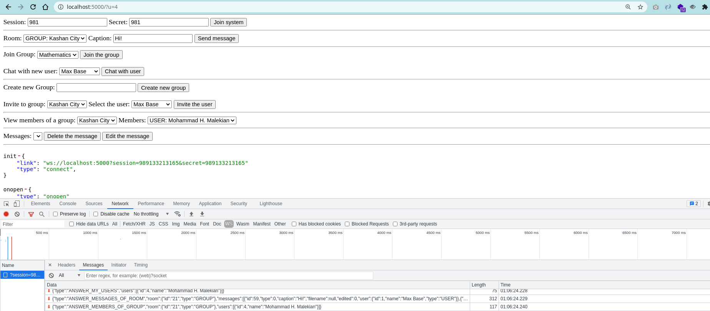
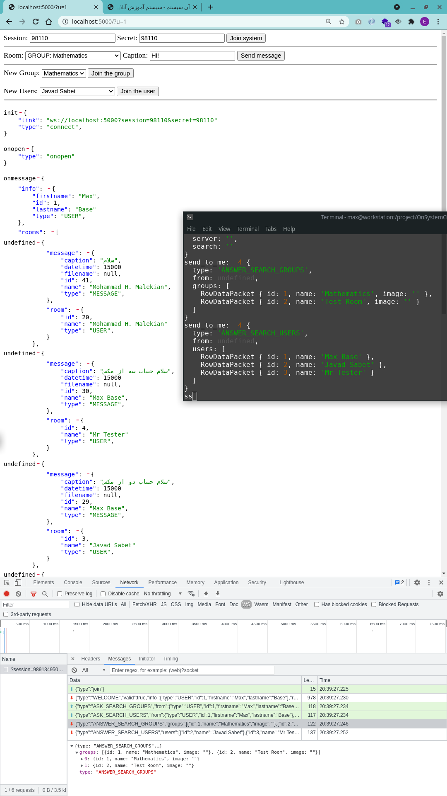

# OnSystemChat

## Using

```
node app.js
```
Open the `http://localhost:5000/` in the browser.

If you easily want to test and debug, there are some test links:

- `http://localhost:5000/?u=1`
- `http://localhost:5000/?u=2`
- `http://localhost:5000/?u=3`
- `http://localhost:5000/?u=4`

### Database

Mariadb, please import `onsystem.sql` file and put your database configuration details in `app.js` file.

## Preview client-side



