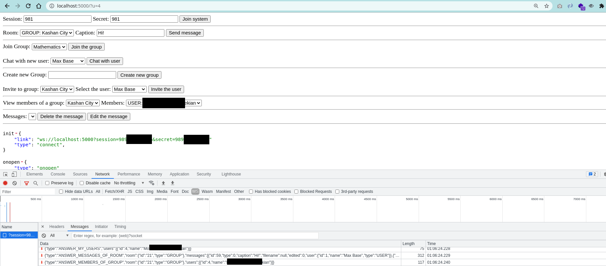

# OnSystemChat

This project took more than ten hours to try to design a native messaging infrastructure.
Its database is a bit complicated, you can check and view its queries.

It was a very interesting and good experience.

## Features

- [x] Pure websocket (Not socket.io)
- [x] Auth/Login
- [x] Chat
- [x] Private Chat
- [x] Group Chat
- [x] Auto-reconnect
- [x] Detect list of online users and active rooms

## Preview client-side



## Using

```
node app.js
```
Open the `http://localhost:5000/` in the browser.

If you easily want to test and debug, there are some test links:

- `http://localhost:5000/?u=1`
- `http://localhost:5000/?u=2`
- `http://localhost:5000/?u=3`
- `http://localhost:5000/?u=4`

## Database

Mariadb, please import `onsystem.sql` file and put your database configuration details in `app.js` file.

### Queries

#### AUTH CONNECT
```
SELECT user.*
		FROM auth
		INNER JOIN user ON auth.user = user.id
		WHERE session = '...' AND secret = '...' AND status = 1
		;
```

#### Old version: PV CHAT LIST OF `user2`
```
SELECT
	MAX(message.id) as message_id,
	(case when (roomtype = 1) THEN 'GROUP' ELSE 'USER' END) as to_type,
	user2.firstname as to_firstname,
	user2.lastname as to_lastname,
	user as from_id,
	(case when (message.type = 0) THEN 'MESSAGE' ELSE 'FILE' END) as message_type,
	caption,
	user.firstname as from_firstname,
	user.lastname as from_lastname
	FROM
		message
	INNER JOIN
		user
		ON
			user.id = message.user
	INNER JOIN
		user as user2
		ON
			user2.id = message.room
	WHERE
	roomtype=2
		AND (room = ${socket.info.id} OR user = ${socket.info.id})
	GROUP BY user
	ORDER BY message_id DESC
	;
```

#### Old version: GROUP CHAT LIST OF `user2`

```
SELECT
		message.id as message_id,
		(case when (message.roomtype = 1) THEN 'GROUP' ELSE 'USER' END) as to_type,
		room.name as to_firstname, '' as to_lastname,
		message.user as from_id,
		(case when (message.type = 0) THEN 'MESSAGE' ELSE 'FILE' END) as message_type,
		message.caption,
		user.firstname as from_firstname,
		user.lastname as from_lastname
	FROM
		message
	INNER JOIN
		room_member
		ON
			message.room = room_member.room
	INNER JOIN
		user
		ON
			user.id = message.user
	INNER JOIN
		room
		ON
			room.id = message.room
	WHERE
		room_member.user = ${socket.info.id}
		AND
		message.roomtype = 1
	ORDER BY message_id DESC
	;
```

#### Old: ALL CHAT LIST OF `user2`
```
(
	SELECT
		MAX(message.id) as message_id,
		(case when (roomtype = 1) THEN 'GROUP' ELSE 'USER' END) as to_type,
		user2.firstname as to_firstname,
		user2.lastname as to_lastname,
		user as from_id,
		(case when (message.type = 0) THEN 'MESSAGE' ELSE 'FILE' END) as message_type,
		caption,
		user.firstname as from_firstname,
		user.lastname as from_lastname
		FROM
			message
		INNER JOIN
			user
			ON
				user.id = message.user
		INNER JOIN
			user as user2
			ON
				user2.id = message.room
		WHERE
		roomtype=2
			AND (room = ${socket.info.id} OR user = ${socket.info.id})
		GROUP BY user
	)
	UNION
	(
		SELECT
			message.id as message_id,
			(case when (message.roomtype = 1) THEN 'GROUP' ELSE 'USER' END) as to_type,
			room.name as to_firstname, '' as to_lastname,
			message.user as from_id,
			(case when (message.type = 0) THEN 'MESSAGE' ELSE 'FILE' END) as message_type,
			message.caption,
			user.firstname as from_firstname,
			user.lastname as from_lastname
		FROM
			message
		INNER JOIN
			room_member
			ON
				message.room = room_member.room
		INNER JOIN
			user
			ON
				user.id = message.user
		INNER JOIN
			room
			ON
				room.id = message.room
		WHERE
			room_member.user = ${socket.info.id}
			AND
			message.roomtype = 1
	)
	ORDER BY message_id DESC
	;
```

### Query

```
SELECT
	    message.id as message_id,
	    message.caption as message_caption,
	    message.type as message_type,
	    message.filename as message_filename,
	    (SELECT CONCAT(user.firstname, " ", user.lastname) as name FROM user as a WHERE id = message.user) as message_sender,
	    room.id as room_id,
	    (CASE WHEN room.name IS NULL THEN 'USER' ELSE 'GROUP' END) as room_type,
	    IFNULL(room.name, (SELECT CONCAT(u.firstname, " ", u.lastname) AS u FROM room_member as r INNER
	           JOIN user as u ON r.user = u.id WHERE r.room = room.id AND u.id != 1
		)) as room_name
	FROM
		room_member
	INNER JOIN
		room
		ON
			room_member.room = room.id
	INNER JOIN
		message
		ON
			message.room = room.id
	INNER JOIN
		user
		ON
			user.id = message.user
	WHERE
		room_member.user = 1
	#    AND
	#    room.id = 3
	GROUP BY
		room.id
	ORDER BY
		message_id DESC
	;
```

#### SELECT NUMBER OF PERSONAL ROOM WITH OTHER ACCOUNTS YOU HAVE ('1' user)

```
SELECT
		COUNT(*)
	    AS
	    	count
	FROM
	(
		SELECT
	        #COUNT(room.id) as count
	        room.id
	        #CONCAT(user.firstname, ' ', user.lastname) as name,
	        #(SELECT COUNT(r.id) FROM room_member as r WHERE room = room.id) as members,
	        #(SELECT COUNT(rm.user) FROM room_member as rm WHERE rm.room = room.id AND rm.user = 1) as my_at
	    FROM
	        room
	    INNER JOIN
	        room_member
	        ON
	            room_member.room = room.id
	    INNER JOIN
	        user
	        ON
	            user.id = room_member.user
	    WHERE
	        user.id != 1
	    #	(
	    #        room_member.user = 4
	    #        OR
	    #        room_member.user = 1
	    #    )
	        AND
	        room.isgroup = 0
	    GROUP BY
	        room.id
	    HAVING
	        (SELECT COUNT(rm.user) FROM room_member as rm WHERE rm.room = room.id AND rm.user = 1) = 1
	    #    AND
	    #    (SELECT COUNT(rm.user) FROM room_member as rm WHERE rm.room = room.id AND rm.user != 1) = 2
	        AND
	        (SELECT COUNT(r.id) FROM room_member as r WHERE room = room.id) = 2

	    #(SELECT COUNT(id) FROM `room_member` WHERE user = 4;
	    #SELECT COUNT(id) FROM `room_member` WHERE user = 1;
	)
	as count
	;
```


#### DOES USER `1' has a private room with user '3'? if count is 0 mean no, if that is 1, so yes they have a private room
```
SELECT
		3
	IN
	(
		SELECT
	    	user.id
	    FROM
	        room
	    INNER JOIN
	        room_member
	        ON
	            room_member.room = room.id
	    INNER JOIN
	        user
	        ON
	            user.id = room_member.user
	    WHERE
	        user.id != 1
	        AND
	        room.isgroup = 0
	    GROUP BY
	        room.id
	    HAVING
	        (SELECT COUNT(rm.user) FROM room_member as rm WHERE rm.room = room.id AND rm.user = 1) = 1
	        AND
	        (SELECT COUNT(r.id) FROM room_member as r WHERE room = room.id) = 2
	)
	as count
	;
```

© Copyright Max Base, 2021
